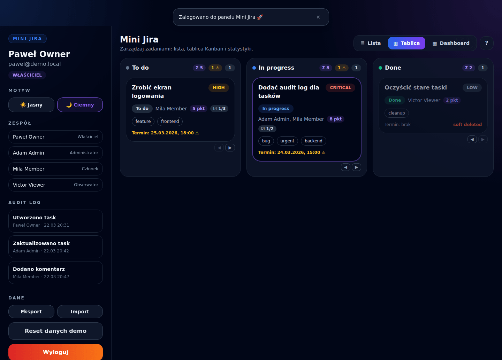
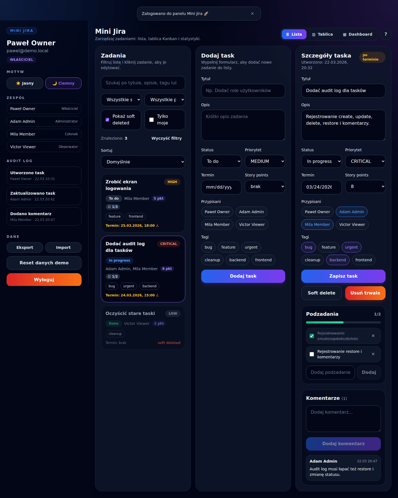
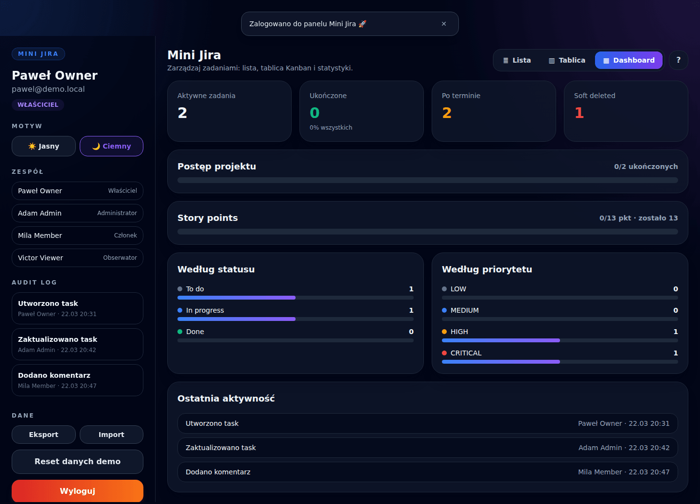
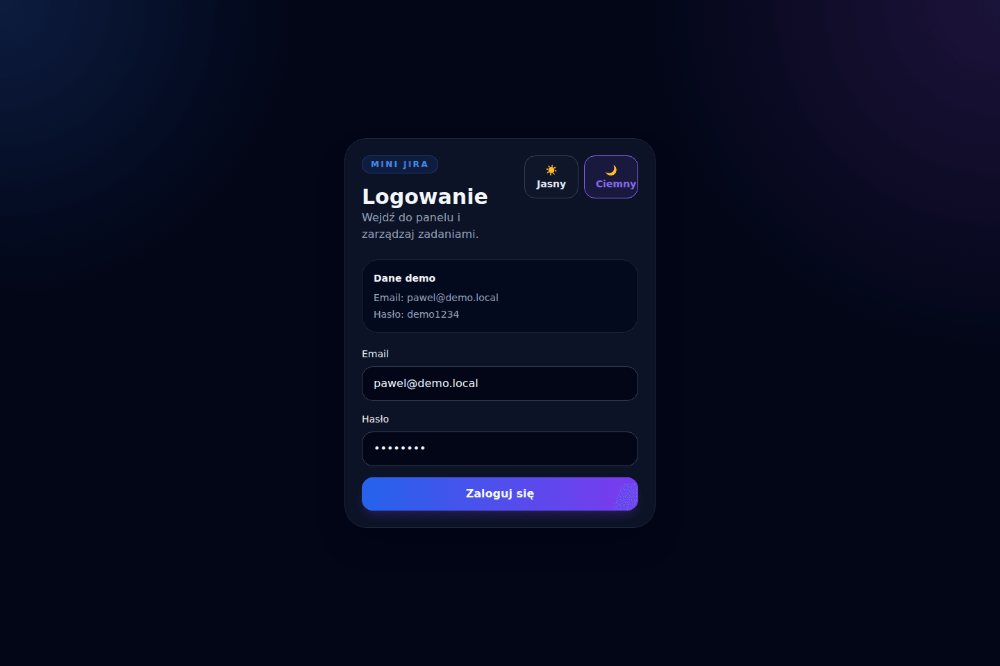
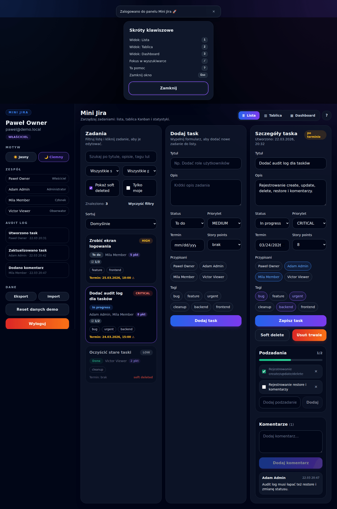
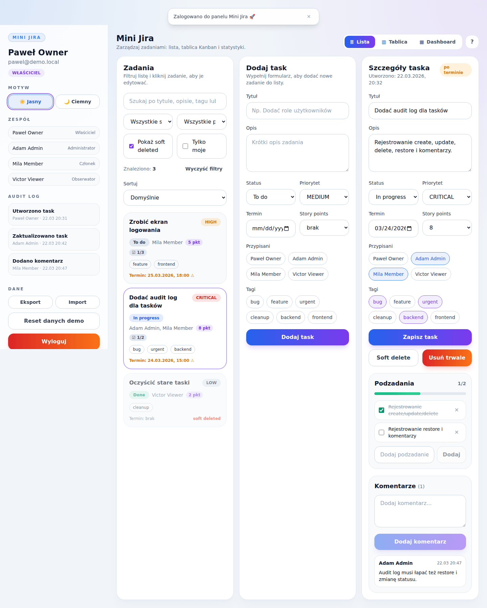
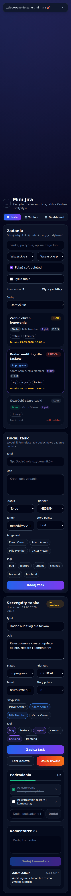
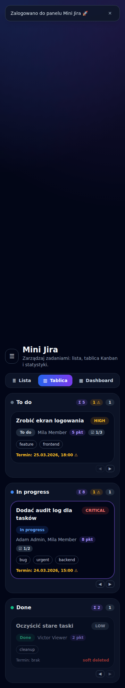

# Mini Jira

Lekki menedżer zadań inspirowany Jirą — zbudowany w **React + TypeScript + Vite + Tailwind CSS**.
Aplikacja działa w całości po stronie przeglądarki, a stan jest zapisywany w `localStorage`.

> Wcześniej projekt był pojedynczym plikiem `mini jira.jsx`, który nie dało się
> uruchomić. Został przebudowany na pełnoprawną, modularną aplikację.

## ✨ Funkcje

- **Logowanie demo** z walidacją (dane: `pawel@demo.local` / `demo1234`).
- **Trzy widoki** przełączane w pasku górnym:
  - **Lista** — filtry, lista zadań, formularz tworzenia i panel edycji.
  - **Tablica Kanban** — kolumny `To do / In progress / Done` z **przeciąganiem** (drag & drop) do zmiany statusu.
  - **Dashboard** — statystyki: liczba zadań, ukończone, po terminie, soft deleted, rozkład wg statusu i priorytetu oraz pasek postępu.
- **Zarządzanie zadaniami**: tworzenie, edycja, soft delete + przywracanie oraz **trwałe usuwanie z modalem potwierdzenia**, priorytety, terminy, przypisani, tagi.
- **Kanban z przeciąganiem**: zmiana statusu i **zmiana kolejności w obrębie kolumny**, na nagłówku kolumny licznik zadań, suma story points (`Σ`) i licznik zadań po terminie. Karty można też przenosić **przyciskami ◀ ▶** (dostępność z klawiatury, bez drag & drop).
- **Podzadania / checklisty** w zadaniu z paskiem postępu i licznikiem `done/total` widocznym także na kafelku.
- **Story points (estymaty)** — pole w formularzu, znacznik na kafelku oraz podsumowanie zrobione/łącznie na dashboardzie.
- **Komentarze** do zadań.
- **Audit log** — każda zmiana (utworzenie, edycja, zmiana statusu, delete/restore, trwałe usunięcie, komentarz, import) jest rejestrowana.
- **Filtrowanie na żywo** po tekście, statusie, priorytecie, widoczności usuniętych oraz **„Tylko moje”** (zadania przypisane do zalogowanego użytkownika) + **paginacja** („Pokaż więcej”).
- **Sortowanie listy** wg priorytetu, terminu, ostatniej zmiany lub tytułu (nie narusza ręcznej kolejności na tablicy Kanban).
- **Eksport / import danych** do pliku JSON (kopia zapasowa stanu).
- **Trwałość danych** — zadania, komentarze, audit log, motyw, widok i sesja zapisywane w `localStorage`.
- **Skróty klawiszowe**: `1` / `2` / `3` przełączają widoki, `/` ustawia fokus w wyszukiwarce, `?` otwiera okno z pomocą skrótów.
- **Motyw jasny/ciemny** (Tailwind `dark` mode).
- **Powiadomienia** jako stos toastów z auto-znikaniem.
- **Dostępność i UX**: etykiety formularzy, `aria-*`, focus ring, obsługa `prefers-reduced-motion`, responsywny layout (mobilny drawer menu), oznaczenia zadań po terminie.

## 🖼️ Zrzuty ekranu

Zrzuty pochodzą z builda produkcyjnego (`npm run build` + `vite preview`)
i są robione automatycznie przeglądarką sterowaną skryptem — to stan
aplikacji z tego commita, nie makieta.

### Tablica Kanban


### Lista zadań


### Dashboard


### Logowanie


### Pomoc skrótów klawiszowych


### Motyw jasny


### Widok mobilny



## 🚀 Uruchomienie

```bash
npm install      # instalacja zależności
npm run dev      # serwer deweloperski (http://localhost:5173)
npm run build    # produkcyjny build do dist/
npm run preview  # podgląd builda produkcyjnego
npm run typecheck# sprawdzenie typów (tsc -b)
npm run lint     # ESLint
npm test         # testy jednostkowe (Vitest)
npm run test:watch # testy w trybie watch
```

## ✅ Testy i CI

- **Vitest + React Testing Library** (środowisko `jsdom`). Testy obejmują
  helpery (`format`, `sort`, `stats`, `exportImport`), store (`useJiraStore`)
  oraz komponenty (logowanie, Kanban, podzadania, filtry) — łącznie 45 testów.
- **Error boundary** — nieoczekiwane błędy pokazują przyjazny ekran zamiast
  pustej strony.
- **GitHub Actions** (`.github/workflows/ci.yml`) na każdy push i PR uruchamia
  kolejno: `lint → typecheck → audyt zależności → test → build`.
- **`npm audit` zwraca 0 podatności.** CI blokuje merge przy poziomie `high`
  lub wyższym.

## 🌐 Wdrożenie

Aplikacja jest w całości kliencka — nie ma backendu, bazy ani zmiennych
środowiskowych, więc wystarcza jej statyczny hosting.

### GitHub Pages (skonfigurowane)

`.github/workflows/pages.yml` buduje i publikuje `dist/` po każdym pushu
do `main`. Dwie rzeczy, które trzeba było w tym celu rozwiązać:

- **Ścieżka bazowa.** Pages serwuje projekt pod `/<nazwa-repo>/`, a nie
  w korzeniu domeny, więc bez ustawienia `base` wszystkie odwołania do
  plików z `dist/` kończyłyby się na 404. `vite.config.ts` bierze ją ze
  zmiennej `VITE_BASE`, a nie wpisuje na sztywno — dzięki temu ten sam kod
  działa też w korzeniu (Vercel, Netlify, `vite preview`).
- **Odświeżenie podstrony.** Pages nie umie przepisywać ścieżek, więc
  workflow kopiuje `index.html` na `404.html`. Bez tego wejście pod
  dowolny adres inny niż główny pokazywałoby stronę błędu GitHuba.

> **Wymaga jednorazowego kroku ręcznego:** w ustawieniach repozytorium
> (Settings → Pages) źródło trzeba przestawić na **GitHub Actions**.
> Tego nie da się zrobić z poziomu kodu.

### Vercel / Netlify

Bez żadnej konfiguracji: build `npm run build`, katalog `dist`. Zmiennej
`VITE_BASE` nie ustawiamy, bo tam aplikacja stoi w korzeniu.

## 🗂️ Struktura projektu

```
src/
  App.tsx                 # orkiestracja: auth, widoki, layout, handlery
  main.tsx                # punkt wejścia React
  index.css               # Tailwind + style bazowe
  types.ts                # wspólne typy domenowe
  data/seed.ts            # dane startowe, zespół, opcje, dane demo
  lib/
    badges.ts             # mapy klas Tailwind dla statusów/priorytetów
    format.ts             # formatowanie dat, isOverdue, makeId
    labels.ts             # polskie etykiety akcji i ról
    storage.ts            # bezpieczny wrapper na localStorage
    sort.ts               # sortowanie listy zadań
    stats.ts              # agregacja story points
    exportImport.ts       # budowanie/parsowanie/pobieranie JSON
  hooks/
    useJiraStore.ts       # reducer zadań/komentarzy/audit + persystencja
    useTheme.ts           # motyw + klasa `dark` na <html>
    useToast.ts           # stos powiadomień z auto-dismiss
    useKeyboardShortcuts.ts # globalne skróty klawiszowe
  test/setup.ts           # konfiguracja Vitest + jest-dom
  components/
    auth/LoginScreen.tsx
    layout/Sidebar.tsx, Topbar.tsx
    tasks/TaskForm.tsx, TaskCard.tsx, TaskFilters.tsx,
          CreateTaskPanel.tsx, TaskDetailsPanel.tsx, Comments.tsx, Subtasks.tsx
    views/ListView.tsx, KanbanBoard.tsx, Dashboard.tsx
    ui/Button.tsx, Badge.tsx, Chip.tsx, Field.tsx,
       EmptyState.tsx, Toast.tsx, ThemeToggle.tsx, ConfirmDialog.tsx
```

## 🧱 Architektura

- **Stan zadań** trzyma `useJiraStore` (oparty na `useReducer`). Każda mutacja
  jest czysta, automatycznie dopisuje wpis do audit logu i zapisuje stan do
  `localStorage`.
- **Motywowanie** opiera się na wariancie `dark:` Tailwinda — przełącznik dodaje/usuwa
  klasę `dark` na `<html>`, więc nie ma rozjazdu warunkowych klas w komponentach.
- **Formularze** (tworzenie/edycja) używają wspólnego `TaskForm`. Panel edycji
  resetuje się przez `key={task.id}`, więc zawsze startuje od aktualnego zadania.

## 📦 Stack

React 18 · TypeScript 5 · Vite 8 · Tailwind CSS 3 · Vitest 5 · ESLint

## 📄 Licencja

MIT — patrz [LICENSE](LICENSE).
